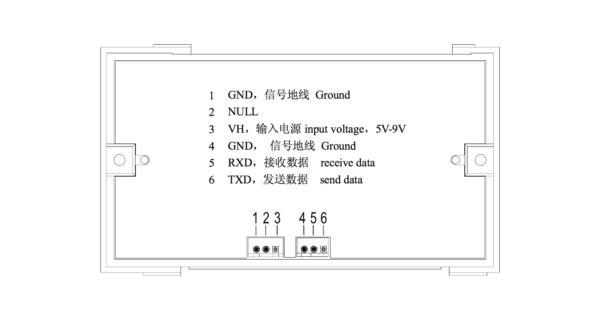
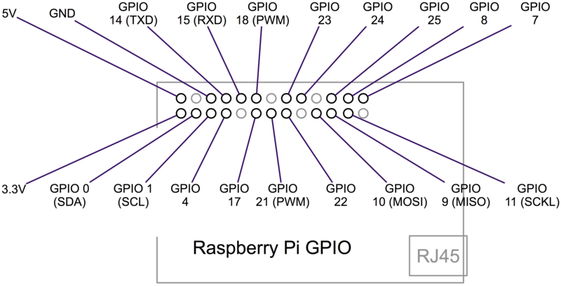
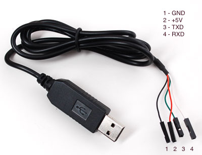

Small Console program to print with [Adafruit Mini Thermal-Printer](http://www.adafruit.com/products/597)

[](http://www.adafruit.com/products/597)

## Setting Up

### 1. Install drivers (MacOS/Windows)

If you are running ```tprint``` from a desktop or laptop computer you need to connect the printer to the serial port of you computer using a [USB to TTL cable like this one](https://www.adafruit.com/product/954)

**Note** that you will need to install the PL2303 drivers first:

* [MacOSX 10.6 to 10.10](https://www.adafruit.com/images/product-files/954/md_PL2303_MacOSX_10_6up_v1_5_1.zip) or for [Lion/Mountan Lion or later](http://changux.co/osx-installer-to-pl2303-serial-usb-on-osx-lio)
* [Windows XP/Vista/7/8](http://www.prolific.com.tw/US/ShowProduct.aspx?p_id=225&pcid=41)

### 2. Connect the ThermoPrinter



After connecting the thermo printer’s 1 and 3 pins to a power supply ([see this link](https://learn.adafruit.com/mini-thermal-receipt-printer/power)) you need to connect the ground (4 - GND) and receive (5 - RXD) pins to the ground (GND) and send (TXD) pins of your [RaspberryPi](https://www.adafruit.com/products/2358) or [USB to TTL cable like this one](https://www.adafruit.com/product/954)





### 3. Compile and Install

```bash
git clone https://github.com/patriciogonzalezvivo/tprint.git
cd tprint
make
sudo make install
```

## Use

```bash
tprint -s Hello World
tprint test.txt
tprint text.jpg
tprint text.* -s I just print all
```
