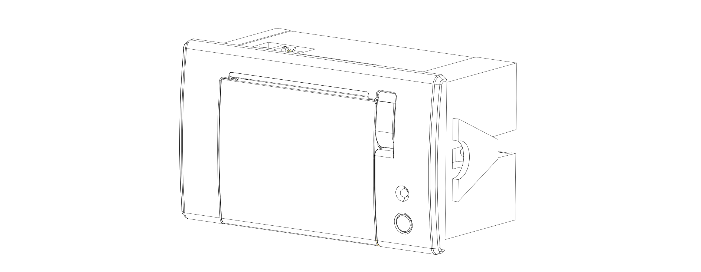
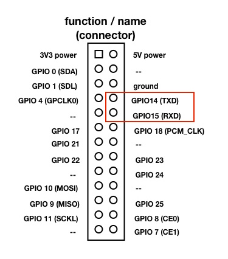

Small Console program to print with [Adafruit Mini Thermal-Printer](http://www.adafruit.com/products/597)

[](http://www.adafruit.com/products/597)

## 1. Set up

#### 1.1. Install drivers 

If you are running ```tprint``` from a desktop or laptop computer you need to connect the printer to the serial port of you computer using a [USB to TTL cable like this one](https://www.adafruit.com/product/954)

**Note** that you will need to install the PL2303 drivers first:

* [MacOSX 10.6 to 10.10](https://www.adafruit.com/images/product-files/954/md_PL2303_MacOSX_10_6up_v1_5_1.zip) or for [Lion/Mountan Lion or later](http://changux.co/osx-installer-to-pl2303-serial-usb-on-osx-lio)
* [Windows XP/Vista/7/8](http://www.prolific.com.tw/US/ShowProduct.aspx?p_id=225&pcid=41)

If you plan to work on a RaspberryPi don’t forget first to disable the console on RX/TX pins. How?

Enter the following command from the command line:

```bash
sudo nano /boot/cmdline.txt
```

And change:

```
dwc_otg.lpm_enable=0 console=ttyAMA0,115200 kgdboc=ttyAMA0,115200 console=tty1 root=/dev/mmcblk0p2 rootfstype=ext4 elevator=deadline rootwait
```

to:

```
dwc_otg.lpm_enable=0 console=tty1 root=/dev/mmcblk0p2 rootfstype=ext4 elevator=deadline rootwait
```

(e.g., remove ```console=ttyAMA0,115200``` and if there, ```kgdboc=ttyAMA0,115200```)

Then from the command prompt enter the following command:

```bash
sudo nano /etc/inittab
```

And change:

```
#Spawn a getty on Raspberry Pi serial line
T0:23:respawn:/sbin/getty -L ttyAMA0 115200 vt100
```

to:

```
#Spawn a getty on Raspberry Pi serial line
#T0:23:respawn:/sbin/getty -L ttyAMA0 115200 vt100
```

That is, **add a #** to the beginning of the line!

Finally run ```sudo shutdown -h now``` to shutdown and restart your RaspberrPi safely.

#### 1.2. Connect the ThermoPrinter


After connecting the thermo printer’s 1 and 3 pins to a power supply ([see this link](https://learn.adafruit.com/mini-thermal-receipt-printer/power)) you need to connect the ground (4 - GND) and receive (5 - RXD) pins to the ground (GND) and send (TXD) pins of your [RaspberryPi](https://www.adafruit.com/products/2358) or [USB to TTL cable like this one](https://www.adafruit.com/product/954)




#### 1.3. Compile and Install

```bash
git clone https://github.com/patriciogonzalezvivo/tprint.git
cd tprint
make
sudo make install
```

## 2. Use

```bash
tprint -s Hello World
tprint test.txt
tprint text.jpg
tprint text.* -s I just print all
```
