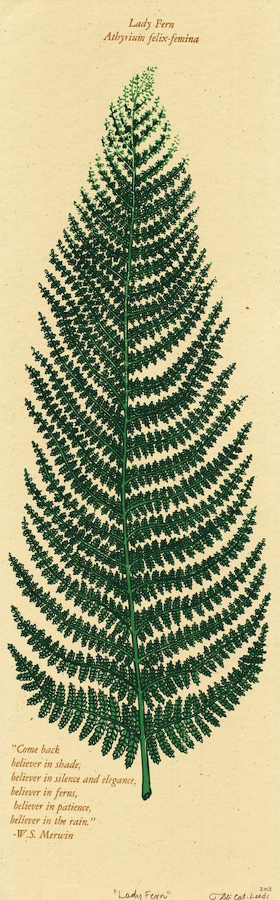

# Athyrium filix-femina

Commonly called **lady fern**, is a deciduous fern that features lacy-cut, 2 to 3-pinnate or pinnatifid, finely-divided, lanceolate, light green fronds which grow in a dense circular shuttlecock-like clump to 2-3' tall. Each frond (leaf) has twenty to thirty pairs of elliptic non-opposite pinna (leaflets) with narrow pointed tips. Each pinna is divided into deeply-cut lanceolate to oblong pinnules (subleaflets).